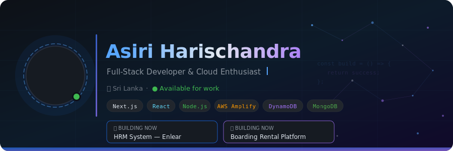

<div align="center">

<!-- ANIMATED BANNER -->
<!-- Save banner.svg to your repo root and reference it like this: -->


<!-- Visitor counter + badges -->
<p>
  
  &nbsp;
  
  &nbsp;
  
</p>

</div>

---

## About Me

```ts
const asiri = {
  name:       "Asiri Harischandra",
  location:   "Sri Lanka 🇱🇰",
  role:       "Full-Stack Developer",
  focus:      ["Next.js", "AWS Amplify Gen 2", "Serverless Architecture"],
  currentlyBuilding: [
    "HRM System for Enlear",
    "Boarding Rental Web Platform"
    "E-learning Platform"
  ],
  learning:   ["System Design", "Cloud-Native Patterns"],

};
```

---

## 🛠️ Tech Stack

**Frontend**


**Backend & Cloud**


**Databases**


<details>
<summary>🔧 Tools & Extras</summary>
<br/>


</details>

---

##  Current Projects

<table>
<tr>
<td width="25% ">

###  HRM System — Enlear
Full-featured Human Resource Management platform with:
- 👥 Employee management & org charts
- 💰 Payroll processing
- 📅 Attendance & leave tracking
- 📊 Analytics dashboard

**Stack:** `Next.js` · `Amplify Gen 2` · `DynamoDB`

</td>
<td width="25% ">

###  Boarding Rental Platform (Ongoing Project)
End-to-end rental marketplace for boarding houses:
- 🔍 Smart search & filtering
- 📸 Photo listings & maps
- 📆 Real-time booking system
- 💳 Payment integration

**Stack:** `Next.js` · `Node.js` · `MongoDB`

</td>

<td width="25% ">

###  LearnSphere — E-Learning Platform (Ongoing Project)
Gamified learning platform with dual ranking system:
- 🏆 Student & tutor leaderboards
- 🎯 XP points, streaks & tier badges
- 📹 Video courses with live classes
- 💳 Course purchase & tutor slot plans

**Stack:** `Next.js` · `Spring Boot` · `MongoDB` · `React Native`

</td>
<td width="25% ">

###  More coming soon...
...

</td>

</tr>
</table>

---

##  GitHub Stats

<div align="center">


&nbsp;


</div>

---

##  Contribution Graph
<div align="center">


</div>

---

##  GitHub Trophies

<div align="center">


</div>

---

##  Connect With Me

<div align="center">

[](https://www.linkedin.com/in/AsiriHarischandra-2209b3305/)
[](https://asiriharischandra.dev)
[](https://www.facebook.com/asiri.harischandra)
[](mailto:asiriharischandra33@gmail.com)
[](https://dev.to/asiriharischandra)

</div>

---

<div align="center">
  
</div>

<div align="center">
  <sub>Built with ❤️ by Asiri Harischandra · Sri Lanka 🇱🇰</sub>
</div>
